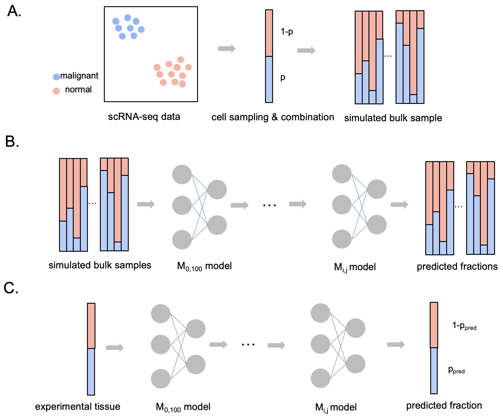

# DeepDecon: A Deep-learning Method for Estimating Cell Fractions in Bulk RNA-seq Data with Applications to AML

### Overview
Here, we present `DeepDecon`, a deep neural network model leveraging single-cell gene expression information to accurately predict the fraction of cancer cells in bulk tissues. `DeepDecon` was trained based on single-cell RNA sequencing data and was robust to experimental biases and noises. It will automatically select optimal models to recursively estimate malignant cell fractions and improve prediction accuracy. When applied to bone marrow data (see Tutorials), it outperforms existing decomposition methods in both accuracy and robustness. We further show that the `DeepDecon` is robust to the number of single cells within a bulk sample.

### Requirements
- tensorflow                1.14.0
- scikit-learn              0.24.2
- python                    3.6.12
- pandas                    1.1.3
- numpy                     1.19.2
- keras                     2.3.1
- scanpy                    1.7.2

### Installation
Download DeepDecon by

```git
git clone https://github.com/Jiawei-Huang/DeepDecon.git
```
Installation has been tested in a Linux and MacOs platform with Python3.6. GPU is recommended for accelerating the training process.

### Instructions
This section provides instructions on how to run DeepDecon with scRNA-seq datasets.
#### Data preparation
Several scRNA-seq AML datasets have been prepared as the input of DeepDecom model. These datasets can be downloaded from the [zenode repository](https://zenodo.org/record/7223362#.Y0-CH-yZNhE). Uncompress the `datasets.tar.gz` in `datasets` folder then each dataset will have its own file, which denotes the gene expression matrix (`XXX_norm_sc.txt`, `XXX` refers to the subject name). Each row in the matrix refers to one cell and the first column of the matrix refers to the cell type (malignant/normal), the rest columns refer to genes.
#### Bulk sample simulation
DeepDecon construct bulk RNA-seq samples through the `get_bulk_samples.py` script. One can try generate a bulk RNA-seq dataset with any ratio of malignant cell by running
```bash
python ./src/get_bulk_samples.py --cells=500 --samples=200 --subject=AML328-D29 --start=10 --end=20  --out=./bulk_datasets/
```
Above example will generate a bulk RNA-seq dataset with 200 samples and each sample contains 500 single cells. The malignnat fraction of each sample is between 0.1 and 0.2. For details of each parameter, one can run
```bash
python ./src/get_bulk_samples.py --help
```
#### Model training
As long as we have the data, one can train DeepDecon models by running
```bash
python train_model.py [--cells CELLS] [--path PATH] [--start START] [--end END]
--cells CELLS  Number of cells to use for each bulk sample.
--path PATH    Training data directory
--start START  Fraction start range of generated samples e.g. 0 for [0, 100]
--end END      Fraction end range of generated samples e.g. 0 for [0, 100]
```
#### Model evaluation
Next, people can get predictions by running
```bash
python eval.py [--cells CELLS] [--dir DIR] [--filepath FILEPATH] [--sub_idx SUB_IDX]

--cells CELLS        Number of cells to use for each bulk sample.
--dir DIR            Training data directory
--filepath FILEPATH  Testing file path
--sub_idx SUB_IDX    Testing subject index, 0-14 refers to subjects in the
                    training datasets, 15 means new dataset.
```

### Tutorial
See `DeepDecon_example.ipynb` for reproducing the experimental results in this paper.
### Contact
Feel free to open an issue on Github or contact [me](jiaweih@usc.edu) if you have any problem in running DeepDecon.

