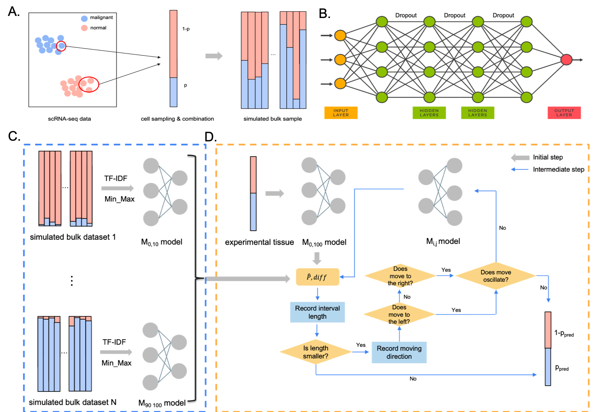

# DeepDecon accurately estimates cancer cell fractions in bulk RNA-seq data

### Overview
Here, we present `DeepDecon`, a deep neural network model leveraging single-cell gene expression information to accurately predict the fraction of cancer cells in bulk tissues. `DeepDecon` was trained based on single-cell RNA sequencing data and was robust to experimental biases and noises. It will automatically select optimal models to recursively estimate malignant cell fractions and improve prediction accuracy. When applied to bone marrow data (see Tutorials), it outperforms existing decomposition methods in both accuracy and robustness. We further show that the `DeepDecon` is robust to the number of single cells within a bulk sample.

### Requirements
- tensorflow                1.14.0
- scikit-learn              0.24.2
- python                    3.6.12
- pandas                    1.1.3
- numpy                     1.19.2
- keras                     2.3.1
- scanpy                    1.7.2

### Installation
Download DeepDecon by

```git
git clone https://github.com/Jiawei-Huang/DeepDecon.git
```
The installation has been tested in a Linux and Mac OS platform with Python3.6. GPU is recommended for accelerating the training process.

### Instructions
This section provides instructions on how to run DeepDecon with scRNA-seq datasets.
#### Data Preparation
Several scRNA-seq AML datasets have been prepared as the input of the DeepDecom model. One can get the scRNA-seq AML data from Gene Expression Omnibus (GEO) under accession number GSE116256, Neuroblastoma data was downloaded from the Gene Expression Omnibus (GEO) with accession GSE137804 and Head and neck squamous cell carcinoma (HNSCC) cancer data was collected from a database [TISCH](http://tisch.comp-genomics.org/).
#### Bulk sample simulation
DeepDecon constructs bulk RNA-seq samples through the `get_bulk_samples.py` script. One can try to generate a bulk RNA-seq dataset with any ratio of malignant cell by running
```bash
python ./src/get_bulk_samples.py [-h] [--cells CELLS] [--samples SAMPLES] [--subject SUBJECT] [--start START] [--end END] [--binomial BINOMIAL] [--data DATA] [--out OUT]
-h, --help            show this help message and exit
--cells CELLS         Number of cells to use for each bulk sample.
--samples SAMPLES, -n SAMPLES
                      Total number of samples to create for each dataset.
--subject SUBJECT     Subject name
--start START         Fraction start range of generated samples e.g. 0 for [0, 100]
--end END             Fraction end range of generated samples e.g. 0 for [0, 100]
--binomial BINOMIAL   Whether generating bulk fractions from binomial distribution, 0=False, 1=True
--data DATA           Directory containg the datsets
--out OUT             Output directory
```
#### Model training
As long as we have the data, one can train DeepDecon models by running
```bash
python train_model.py [-h] [--cells CELLS] [--path PATH] [--lr LR] [--bs BS]
                      [--dr DR] [--start START] [--end END] [--scaler SCALER]
                      [--normalization NORMALIZATION]
  -h, --help            show this help message and exit
  --cells CELLS         Number of cells to use for each bulk sample.
  --path PATH           Training data directory
  --lr LR               learning rate index k, lr = 10^(-k)
  --bs BS               batch size
  --dr DR               dropout
  --start START         Fraction start range of generated samples e.g. 0 for
                        [0, 100]
  --end END             Fraction end range of generated samples e.g. 100 for
                        [0, 100]
  --scaler SCALER       Scaler of neural network, MinMaxScaler (mms) or
                        StandardScaler (ss)
  --normalization NORMALIZATION
                        Normalization methods,TF-IDF, FPKM, CPM or TPM
```
#### Model evaluation
Next, people can get predictions by running
```bash
python eval.py [--cells CELLS] [--dir DIR] [--filepath FILEPATH] [--sub_idx SUB_IDX]

--cells CELLS        Number of cells to use for each bulk sample.
--dir DIR            Training data directory
--filepath FILEPATH  Testing file path
--sub_idx SUB_IDX    Testing subject index, 0-14 refers to subjects in the
                    training datasets, 15 means new dataset.
```

### Tutorial
See `DeepDecon_example.ipynb` for reproducing the experimental results in this paper.
### Contact
Feel free to open an issue on GitHub or contact [me](jiaweih@usc.edu) if you have any problem in running DeepDecon.

